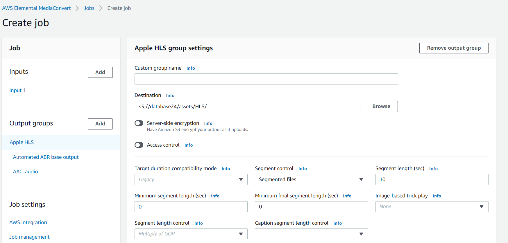
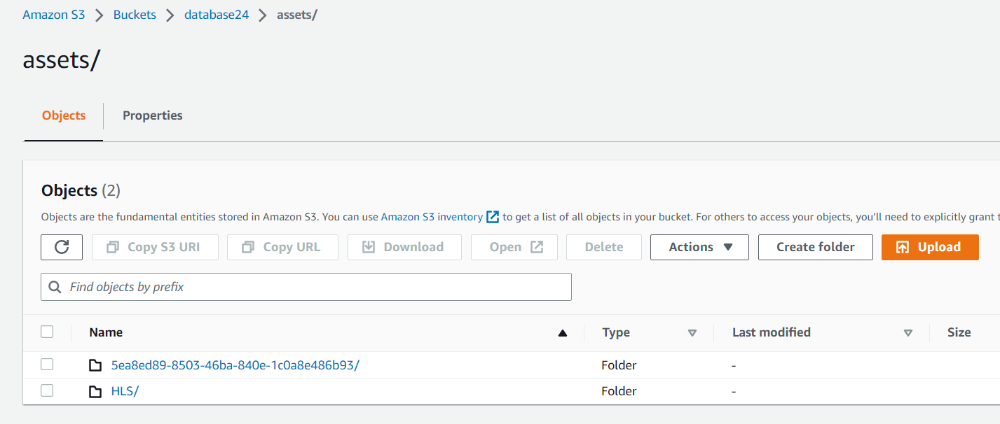
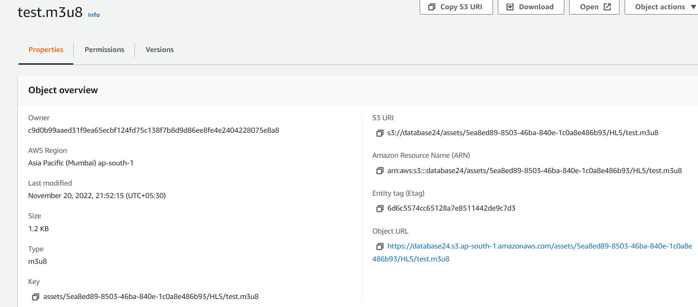

# Phase 2: AWS Elemental MediaConvert Jobs

Whether you are working with video for a web application, an Over the Top (OTT, i.e. via the internet) platform, or for broadcast cable, you will need to deliver the video in some standard format that ensures a high quality and consistent experience to viewers. Broadcast and OTT video platforms, such as cable TV channels and Apple TV, specify, in detail, the video features, packaging and encoding that their platforms can decode and play out.  MediaConvert provides the mechanism for converting videos to formats that conform to these policies. 

Example of an OTT video standard:
    
* The [HLS Authoring Specification for Apple Devices](https://developer.apple.com/library/content/documentation/General/Reference/HLSAuthoringSpec/index.html#//apple_ref/doc/uid/TP40016596) gives details about the component outputs of adaptive bitrate stacks supported by Apple devices including information about codecs, bitrates, and resolutions they support.

Example of a broadcast video standard:

* The [CableLabs Mezzanine Encoding Specification](https://apps.cablelabs.com/specification/mezzanine-encoding-specification) specifies a standard for encoding and packaging for video content that will be exchanged and reused by downstream workflows.   For example, you might choose this standard if you wanted to archive news videos in a content management system and then resell them to downstream consumers. 

In this project, you'll use AWS Elemental MediaConvert to convert videos into HLS format with the help of Automated ABR feature in MediaConvert.

**Apple HLS Format** - this is an example of an _adaptive bitrate stack_ that encodes the source into multiple files at different data rates and divides them into short chunks, usually between 5-10 seconds long. These are loaded onto an HTTP server along with a text-based manifest file with a .M3U8 extension that directs the player to additional manifest files for each of the encoded streams.  

## Prerequisites

You need to have access to MediaConvert and S3 to complete this phase. 

You need the following resources created in phase 1:
* **MediaConvertRole** - the role created to give permission for MediaConvert to access resources in your account.
* **MediaBucket** - the bucket created to store outputs from MediaConvert

A MediaConvert job reads an input video from S3 and converts the video to multiple output groups that in turn can have multiple outputs.  A single media convert job can create multiple versions of the input video in different codecs and packages.

## 1. Load a MediaConvert Job

In this phase, you will import a MediaConvert job that take a single input video and converts the video into HLS format Using the default json setting for Automated ABR HLS straming.To view default job setting click [here](https://docs.aws.amazon.com/mediaconvert/latest/ug/example-job-settings.html#auto-abr-example)
 
 Altenatively you can find it in this folder also.click here to view

If you want to create a job then refer [documentation](https://docs.aws.amazon.com/mediaconvert/latest/ug/setting-up-a-job.html)

For Importing and exporting mediaconvert jobs refer [here](./ExportImportJob.md)

### Detailed Instructions

#### Inputs section

1. Open the MediaConvert console for the region you are completing this phase in (ap-south-1-Mumbai). https://ap-south-1.console.aws.amazon.com/mediaconvert/home?region=ap-south-1#/welcome
1. Select **Jobs** from the side bar menu. 
1. Select **Import job** to import the  job.
1. Ensure that you have changed the Role ARN, Destination, FileInput in json file given here.
1. Give a sample video as input.
1. AS of now choose input and output as same bucket that you created earlier.
1. create a folder path as `assets/HLS/` and specify this path for destination. 

    

#### Create the job

1. Scroll to the bottom of the page and select **Create**
1. Wait for the job to complete.  Monitor the status of the job by refreshing the **Job details** page using the **refresh** button. 

    

## 2. View outputs in S3  

1. In the AWS Management Console choose **Services** then select **S3** under Storage.
2. Select the bucket where your output files are located.  You should find a folder called `assets/HLS/`
3. **Save this page open in a browser tab** so you can access videos for playout in later phase.

NOTE: You can also access the S3 bucket for each output group using the links in the **Outputs** section of the MediaConvert console **Job details** page.

## 3. Play the videos

To play the videos, you will use the S3 HTTPS resource **Object Link** on the videos S3 object **Overview** page.

#### HLS

The HLS manifest file is located in your ouput s3 bucket in the object: s3://YOUR-MediaBucket/assets/HLS/YOUR-File-Name.m3u8

You can play the HLS using:
* Safari browser by clicking on the **Link** for the object.
* **JW Player Stream Tester** - by copying the link for the object and inputing it to the player.  https://developer.jwplayer.com/tools/stream-tester/ 

## Completion

Congratulations!  You have successfully created video conversion job for AWS Elemental MediaConvert. Move forward to the next Phase to automate work with AWS lambda.

Move forward to the next phase [**Creating source bucket and SNS notification**](../3-S3andSNS/README.md) 

