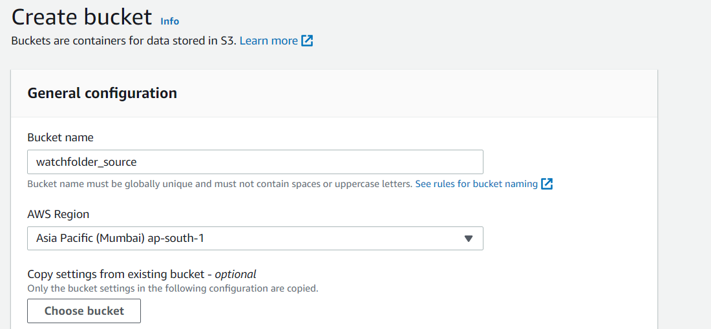

### [1. Create an Amazon S3 bucket to use for uploading videos to be converted](#watchfolder-bucket)

Use the console or AWS CLI to create an Amazon S3 bucket. Keep in mind that your bucket's name must be globally unique across all regions and customers. I recommend using a name like `watchfolder-firstname`. If you get an error that your bucket name already exists, try adding additional numbers or characters until you find an unused name.

1. In the AWS Management Console choose **Services** then select **S3** under Storage.

1. Choose **+Create Bucket**

1. Provide a globally unique name for your bucket such as `watchfolder-firstname`.

1. Select the Region you've chosen to use for this workshop from the dropdown.

1. Choose **Create** in the lower left of the dialog without selecting a bucket to copy settings from.

    

### [2. Create an SNS to get notified about chages in source bucket](#SNS)  

**Step 1: Create a topic**

1. Open Amazon SNS console https://console.aws.amazon.com/sns/home

1. In the left navigation pane, choose Topics.
1. On the Topics page, choose Create topic.
1. By default, the console creates a FIFO topic. Choose Standard.
1. In the Details section, enter a Name for the topic, such as MyTopic.
1. Scroll to the end of the form and choose Create topic.
1. The console opens the new topic's Details page.

**Step 2: Create a subscription to the topic**

1. In the left navigation pane, choose Subscriptions.
1. On the Subscriptions page, choose Create subscription.
1. On the Create subscription page, choose the Topic ARN field to see a list of the topics in your AWS account.
1. Choose the topic that you created in the previous step.
1. For Protocol, choose Email.
1. For Endpoint, enter an email address that can receive notifications.
1. Choose Create subscription.
1. The console opens the new subscription's Details page.
1. Check your email inbox and choose Confirm subscription in the email from AWS Notifications. The sender ID is usually "no-reply@sns.amazonaws.com".
1. Amazon SNS opens your web browser and displays a subscription confirmation with your subscription ID.

**Step 3: Create a access policy to the topic**
1. In the left navigation pane, choose Subscriptions.
1. Replace the access policy attached to the topic with the following policy. In it, provide your SNS topic ARN, bucket name, and bucket owner's account ID.


    ```JSON
     {
        "Version": "2012-10-17",
        Id": "example-ID",
        "Statement": [
            {
                "Sid": "Example SNS topic policy",
                "Effect": "Allow",
                 "Principal": {
                 "Service": "s3.amazonaws.com"
                },
                "Action": [
                    "SNS:Publish"
                ],
                "Resource": "SNS-topic-ARN",
                Condition": {
                    "ArnLike": {
                        "aws:SourceArn": "arn:aws:s3:*:*:bucket-name"
                    },
                    "StringEquals": {
                        "aws:SourceAccount": "bucket-owner-account-id"
                    }
               }
            }
       ]
    }                  
        
    ```
**Step 4: Add a notification configuration to your bucket**

1. Sign in to the AWS Management Console and open the Amazon S3 console at https://console.aws.amazon.com/s3/.
1. In the Buckets list, choose the watchfolder source bucket that you created.
1. Choose Properties.
1. Navigate to the Event Notifications section and choose Create event notification.
1. In the General configuration section, specify descriptive event name for your event notification. Optionally, you can also specify a prefix and a suffix to limit the notifications to objects with keys ending in the specified characters.
    
    - a) Enter a description for the Event name.
        If you don't enter a name, a globally unique identifier (GUID) is generated and used for the name.

    - b) (Optional) To filter event notifications by prefix, enter a Prefix.

      For example, you can set up a prefix filter so that you receive notifications only when files are added to a specific folder (for example, images/).

    - c) (Optional) To filter event notifications by suffix, enter a Suffix.

1. In the Event types section, select All object create events
1. In the Destination section, choose SNS,then choose your sns topic that you created.
1. Choose Save changes, and Amazon S3 sends a test message to the event notification through SNS.

**Step 5: Testing the SNS by uplading a file in s3 bucket**

1. Go to watchfolder source bucket and choose upload files and select add files

1. then choose the test.mp4 file that you downloaded from here [waterfall.mp4](waterfall.mp4).

1. Then click upload ,after file is uploaded you will receive a email response in the form of Json.

1.That's it you have created SNS for your bucket

Move forward to the final phase [**Automating  MediaConvert Jobs with Lambda**](../4-MediaConvertJobLambda/README.md) 
