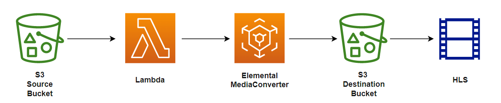

# Automated ABR HLS Transcoding using AWS MediaConvert

This project takes you through development of video transcoding workflow for the conversion of video into Adaptive bitrate streaming format HLS (HTTP live streaming).Using ABR we can dynamically adjust the compression level and video quality match bandwidth availability.

This project is broken up into multiple phases.

----

# Project Architecture

- **S3 Source Bucket**  - used as input for our video trancoding process.

- **Lambda Function**  - used to  automatically trigger the media convert function, as soon as a video is uploaded to the S3 bucket.

- **MediaConvert** - A file-based video transcoding service.It is used for conversion of video into live stream assets (HLS).

- **S3 Destination Bucket** -used to store output of MediaConvert job i.e converted videos

----

# Project Requirements

### AWS Account

In order to complete this project you'll need an AWS Account with access to create AWS MediaConvert, IAM, S3, and Lambda resources.

### Billing

MediaConvert jobs will incur charges based on the region you are using for the project at the rates described in the MediaConvert pricing page: https://aws.amazon.com/mediaconvert/pricing/ .

**Other resources**

S3 and other resources you will launch as part of this project are eligible for the AWS free tier if your account is less than 12 months old. See the [AWS Free Tier page](https://aws.amazon.com/free/) for more details.

### Browser

We recommend you to use the latest web browser to complete thos project.

### Video player

Videos can be played out in the browser if the browser supports them. I sugges using the player below
* **JW Player Stream Tester** https://developer.jwplayer.com/tools/stream-tester/ 

### Text Editor

You will need a local text editor for making minor updates to configuration files.

----

# Project Phases

- [**AWS IAM and S3**](./1-IAMandS3/README.md) - This phase guides you to configure permissions for the AWS services used in this project. You will learn how to create a policy that permits users access to AWS Elemental MediaConvert in your account.  You will also create a role to pass to MediaConvert so it can access resources in your account it needs to run jobs.

- [**AWS Elemental MediaConvert Jobs**](./2-MediaConverJobs/README.md) - This phase guides you to create an AWS Elemental MediaConvert job to convert an mp4 input into HLS output. You will learn about adaptive bitrate delivery and the basics of producing video output for different purposes.

- [**AWS S3 and SNS**](./3-S3andSNS/README.md) - This phase guides you to create a S3 bucket and to configure SNS service which send notification when a file is created in the source S3 bucket.

- [**Automating Jobs with Lambda and S3 Event Triggers**](./4-MediaConvertJobLambda/README.md) - This phase guides you to create a lambda function that automates the video transcoding with the help of MediaConvert and to trigger lambda function using S3.

# Start the Project

Move forward to the first phase [**AWS IAM and S3**](./1-IAMandS3/README.md).